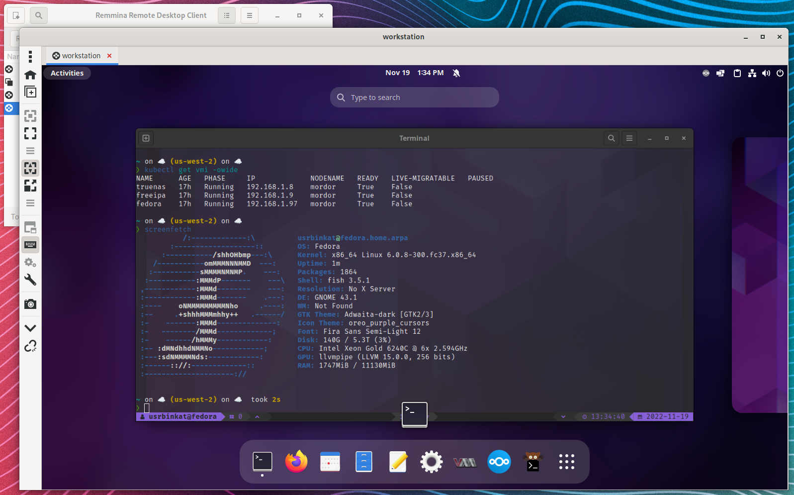
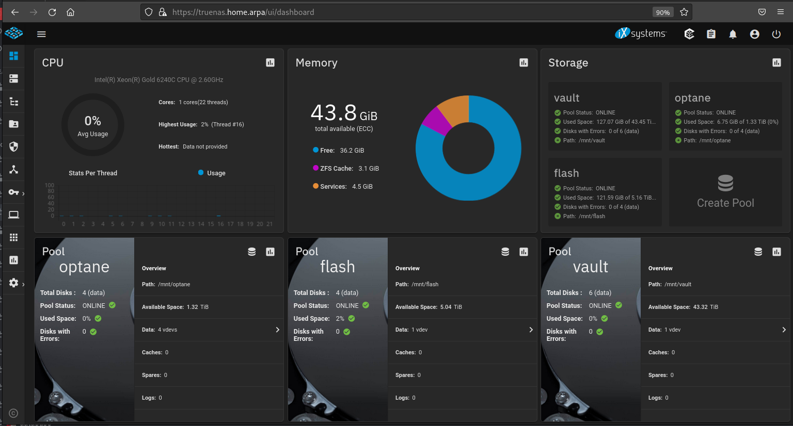

# Homelab Kubevirt VMs
### Fedora VMI xRDP via Remmina
Features:
- Fedora Kubevirt VM
- Gnome3
- xRDP remote access
- Kerberos User Login via FreeIPA
- AutoFS mounted NFS User Homedirectories

### TrueNAS WebUI

